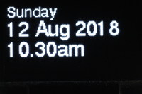
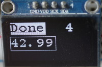
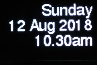
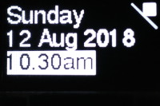
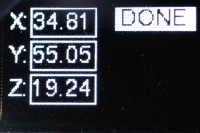

# Writer and Cwriter classes

These classes facilitate rendering Python font files to displays where the
display driver is subclassed from the `framebuf` class. Examples are:

 * The official [SSD1306 driver](https://github.com/micropython/micropython/blob/master/drivers/display/ssd1306.py).
 * The [PCD8544/Nokia 5110](https://github.com/mcauser/micropython-pcd8544.git).
 * The [Adafruit 0.96 inch color OLED](https://www.adafruit.com/product/684)
 with [this driver](https://github.com/peterhinch/micropython-nano-gui/tree/master/drivers/ssd1331).
 * The [Adafruit 1.5 inch color OLED](https://www.adafruit.com/product/1431) and
 the [Adafruit 1.27 inch color OLED](https://www.adafruit.com/product/1673) with
 [this driver](https://github.com/peterhinch/micropython-nano-gui/blob/master/drivers/ssd1351/ssd1351.py)
 for STM32 (Pyboards etc) or [this one](https://github.com/peterhinch/micropython-nano-gui/blob/master/drivers/ssd1351/ssd1351_generic.py)
 for other targets.
 * The [HX1230 96x68 LCD](https://github.com/mcauser/micropython-hx1230.git).

Basic support is for scrolling text display using multiple fonts. The
[nanogui](https://github.com/peterhinch/micropython-nano-gui.git) module has
optional extensions for user interface objects displayed at arbitrary locations
on screen.

Example code and images are for 128*64 SSD1306 OLED displays.

  
Scrolling text, multiple fonts.

  
A field containing variable length text with a border.

  
Right justified text.

  
Mixed text and graphics.

  
Labels and Fields (from nanogui.py).

# Contents

 1. [Introduction](./WRITER.md#1-introduction)  
  1.1 [Hardware](./WRITER.md#11-hardware)  
  1.2 [Files](./WRITER.md#11-files)  
  1.3 [Fonts](./WRITER.md#11-fonts)  
 2. [Writer and CWriter classes](./WRITER.md#2-writer-and-cwriter-classes)  
  2.1 [The Writer class](./WRITER.md#21-the-writer-class) For monochrome displays.  
   2.1.1 [Static Method](./WRITER.md#211-static-method)  
   2.1.2.[Constructor](./WRITER.md#212-constructor)  
   2.1.3 [Methods](./WRITER.md#213-methods)  
  2.2 [The CWriter class](./WRITER.md#22-the-cwriter-class) For colour displays
  and for upside-down rendering.  
   2.2.1 [Static Method](./WRITER.md#221-static-method)  
   2.2.2 [Constructor](./WRITER.md#222-constructor)  
   2.2.3 [Methods](./WRITER.md#223-methods)  
 3. [Notes](./WRITER.md#4-notes)

###### [Main README](../README.md)

# 1. Introduction

The original `Writer` class was a proof of concept intended to demonstrate
rendering, on an SSD1306 OLED display, fonts created by`font_to_py.py`.

This update for practical applications has the following features:  
 * Genarality: capable of working with any `framebuf` derived driver.
 * Multiple display operation.
 * Text display of fixed and variable pitch fonts with wrapping and vertical
 scrolling.
 * Wrap/clip options: clip, character wrap or word wrap.
 * Tab support.
 * String metrics to enable right or centre justification.
 * Inverse (background color on foreground color) display.
 * Inverted display option.

Note that these changes have significantly increased code size. On the ESP8266
it is likely that `writer.py` will need to be frozen as bytecode. The original
very simple version still exists as `writer_minimal.py`.

## 1.1 Hardware

Tests and demos assume a 128*64 SSD1306 OLED display connected via I2C or SPI.
Wiring is specified in `ssd1306_setup.py`. Edit this to use a different bus or
for a non-Pyboard target. At the time of writing the default of software I2C
should be used: the official SSD1306 driver is not compatible with hardware I2C
(see [Notes](./WRITER.md#3-notes)).

## 1.2 Files

 1. `writer.py` Supports `Writer` and `CWriter` classes.
 2. `writer_gui.py` Provides optional GUI objects.
 3. `ssd1306_setup.py` Hardware initialisation for SSD1306. Requires the
 official [SSD1306 driver](https://github.com/micropython/micropython/blob/master/drivers/display/ssd1306.py).
 4. `writer_demo.py` Demo using a 128*64 SSD1306 OLED display. Import to see
 usage information.
 5. `writer_tests.py` Test/demo scripts. Import to see usage information.
 6. `writer_minimal.py` A minimal version for highly resource constrained
 devices.

Sample fonts:
 1. `freesans20.py` Variable pitch font file.
 2. `courier20.py` Fixed pitch font file.
 3. `font10.py` Smaller variable pitch fonts.
 4. `font6.py`

## 1.3 Fonts

Python font files should be created using `font-to-py.py` using horizontal
mapping (`-x` option). The `-r` option is not required. If RAM is critical
fonts may be frozen as bytecode reducing the RAM impact of each font to about
340 bytes.

###### [Contents](./WRITER.md#contents)

# 2. Writer and CWriter classes

The `Writer` class provides fast rendering to monochrome displays using bit
blitting. Most applications will use this class.

The `CWriter` class is a subclass of `Writer`. It can optionally support color
displays. It provides additional functionality in the form of an upside-down
display option. Owing to limitations in the `frmebuf.blit` method the
`CWriter` class renders glyphs one pixel at a time; rendering is therefore
slower than the `Writer` class.

Multiple screens are supported. On any screen multiple `Writer` or `CWriter`
instances may be used, each using a different font. A class variable holds the
state of each screen to ensure that the insertion point is managed across
multiple instances/fonts.

###### [Contents](./WRITER.md#contents)

## 2.1 The Writer class

This class facilitates rendering characters from Python font files to a device,
assuming the device has a driver subclassed from `framebuf`. It supports three
ways of handling text which would overflow the display: clipping, character
wrapping and simple word wrapping.

It handles newline and tab characters, black-on-white inversion, and field
blanking to enable variable length contents to be updated at a fixed location.

Typical use with an SSD1306 display and the official driver is as follows:

```python
from ssd1306_setup import WIDTH, HEIGHT, setup
from writer import Writer
import freesans20  # Font to use

use_spi=False  # Tested with a 128*64 I2C connected SSD1306 display
ssd = setup(use_spi)  # Instantiate display: must inherit from framebuf
# Demo drawing geometric shpes
rhs = WIDTH -1
ssd.line(rhs - 20, 0, rhs, 20, 1)  # Demo underlying framebuf methods
square_side = 10
ssd.fill_rect(rhs - square_side, 0, square_side, square_side, 1)
# Instantiate a writer for a specific font
wri = Writer(ssd, freesans20)  # verbose = False to suppress console output
Writer.set_textpos(ssd, 0, 0)  # In case a previous test has altered this
wri.printstring('Sunday\n12 Aug 2018\n10.30am')
ssd.show()
```

The file `writer_demo.py` illustrates the use of font files with a 128*64
SSD1306 OLED display and the official
[SSD1306 driver](https://github.com/micropython/micropython/blob/master/drivers/display/ssd1306.py).

### 2.1.1 Static Method

The `Writer` class exposes the following static method:

 1. `set_textpos` Args: `device`,`row=None`, `col=None`. The `device` is the
 display instance. This method determines where on screen subsequent text is to
 be rendered. The initial value is (0, 0) - the top left  corner. Arguments are
 in pixels with positive values representing down and right respectively. The
 insertion point defines the top left hand corner of the next character to be
 output.
 
 Where `None` is passed, the setting is left unchanged.  
 Return: `row`, `col` current settings.

 The insertion point applies to all `Writer` instances having the same device.
 The insertion point on a given screen is maintained regardless of the font in
 use.

### 2.1.2 Constructor

This takes the following args:
 1. `device` The hardware device driver instance for the screen in use.
 2. `font` A Python font instance.
 3. `verbose=True` If `True` the constructor emits console printout.

### 2.1.3 Methods

 1. `printstring` Args: `string`, `invert=False`. Outputs a text string at the
 current insertion point. Newline and Tab  characters are honoured. If `invert`
 is `True` the text is output as black on white.
 2. `height` No args. Returns the font height in pixels.
 3. `stringlen` Arg: `string`. Returns the length of a string in pixels. Used
 for right or centre justification.
 4. `set_clip` Args: `row_clip=None`, `col_clip=None`, `wrap=None`. If
 `row_clip` and/or `col_clip` are `True`, characters will be clipped if they
 extend beyond the boundaries of  the physical display. If `col_clip` is
 `False` characters will wrap onto the next line. If `row_clip` is `False` the
 display will, where necessary,  scroll up to ensure the line is rendered. If
 `wrap` is `True` word-wrapping will be performed, assuming words are separated
 by spaces.    
 If any arg is `None`, that value will be left unchanged.  
 Returns the current values of `row_clip`, `col_clip` and `wrap`.
 5. `tabsize` Arg `value=None`. If `value` is an integer sets the tab size.
 Returns the current tab size (initial default is 4). Tabs only work properly
 with fixed pitch fonts.

###### [Contents](./WRITER.md#contents)

## 2.2 The CWriter class

This extends the `Writer` class by adding support for upside-down and/or color
displays. A color value is an integer whose interpretation is dependent on the
display hardware and device driver.

### 2.2.1 Static method

The following static method is added:  
 1. `invert_display` Args `device`, `value=True`. The `device` is the display
 instance. If `value` is set, causes text to be rendered upside down. The
 `set_textpos` method should be called to ensure that text is rendered from the
 bottom right hand corner (viewing the display in its normal orientation).
 
 If a display is to be run inverted, this method must be called prior to
 instantiating a `Writer` for this display.

### 2.2.2 Constructor

This takes the following args:  
 1. `device` The hardware device driver instance for the screen in use.
 2. `font` A Python font instance.
 3. `fgcolor=None` Foreground color. If `None` a monochrome display is assumed.
 4. `bgcolor=None` Background color. If `None` a monochrome display is assumed.
 5. `verbose=True` If `True` the constructor emits console printout.

### 2.2.3 Methods

All methods of the base class are supported. Additional method:  
 1. `setcolor` Args: `fgcolor=None`, `bgcolor=None`. Sets the foreground and
 background colors. If one is `None` that value is left unchanged. If both
 are `None` the constructor defaults are restored. Constructor defaults are
 1 and 0 for monochrome displays (`Writer`). Returns foreground
 and background color values.

The `printstring` method works as per the base class except that the string is
rendered in foreground color on background color (or reversed if `invert` is
`True`).

# 3. Notes

Possible future enhancements:
 1. General rendering to a rectangular area. This may be problematic as the
 `framebuf`  scroll method is only capable of scrolling the entire buffer.
 2. Extend word wrapping to cases where words are separated by tabs or hyphens.
 3. An asynchronous version.

As stated above the official SSD1306 driver is incompatible with hardware I2C
and this problem cannot efficiently be fixed. [PR4020](https://github.com/micropython/micropython/pull/4020)
proposes an enhncement which will facilitate an improved SSD1306 driver capable
of using hard or soft I2C.
 
###### [Contents](./WRITER.md#contents)
